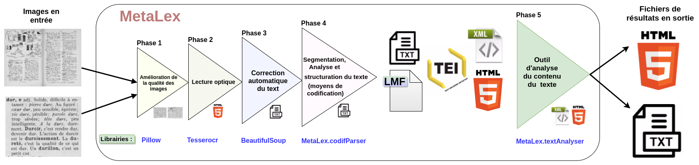
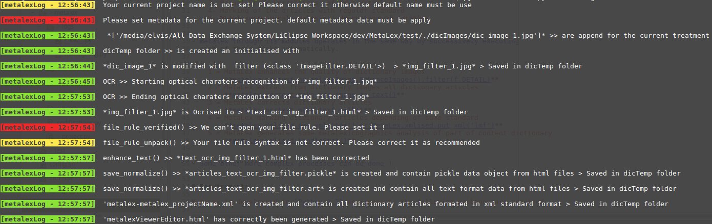

# MetaLex-vagrant
MetaLex is general tool in AGPL Licence for `lexicographics` and `metalexicographics` activities.
For current developpement version of this tool, see [MetaLex/v1.0](https://github.com/Levis0045/MetaLex/tree/v1.0)
or see [MetaLex-vagrant/v1.0](https://github.com/Levis0045/MetaLex-vagrant/tree/v1.0)


[](mteprojet.fr/MetaLex-vagrant)


# Usage

- metalex proceeds in this way (written in french)




- This is an example of process used with MetaLex

```
    I am a metalexicographer or linguist and I have paper dictionaries.
    I want to perform a diachronic study of the evolution of the wording of
    definitions in a collection of dictionaries available from period A to period B.
```

- Traditionally or at best, the contemporary metalexicographer (according to our point of view)
  would apply the following methodology :

```
    1- Scanning of printed materials (Scan) and enhance its qualities
    2- Optical reading of the pictures (Ocrisation) = extract articles content
    3- Manual Error Corrections  of text articles
    4- Marking of the articles with regular standard
    5- Metalexographical analysis / decryption of articles
```

- metalex through its modules operates in the same way by successively executing
  each of these tasks automatically.

```
    1 = MetaLex enhances the quality of dictionary images
        **metalex.ocrtext.normalizeImage.EnhanceImages().filter(f.DETAIL)**
    2 = MetaLex extract from dictionary images all dictionary articles
        **metalex.ocrtext.make_ocr.image_to_text()**
    3 = MetaLex corrects dictionary articles
        **metalex.ocrtext.make_text_well()**
    4 = MetaLex marking dictionary articles depending of some standard
        **metalex.xmlised.put_xml('tei') or MetaLex.xmlised.put_xml('lmf')**
    5 = MetaLex generates some metalexicographics analysis of part of content dictionary
        **metalex.xmlised.handleStat()**
```

- Some other more complex processes can be done !


# Requirements

**Linux**

MetaLex-vagrant is developped in `Python 2.7` and vagrant environment, these packages are required :

- We can install all package dependencies manually

```shell
    sudo apt-get install vagrant
    sudo apt-get install virtualbox
    git clone --depth 3 git@github.com:Levis0045/MetaLex-vagrant.git
    cd MetaLex-vagrant
    git clone --depth 3 git@github.com:Levis0045/MetaLex.git
    vagrant box update    # Update the vagrant box
    vagrant up   # Build vagrant machine with all dependencies
    vagrant ssh  # Connect to ubuntu xenia development
    cd /vagrant

```

- Or we can use `setup.sh` to install all package dependencies : `Make sure to execute this file in the current system partition ext4 otherwise right permission will be raised in NTFS partition`

```shell
    sudo ./setup.sh

```

- Re-install `pillow` to fix Image module functionalities and build documentation

```shell
    sudo pip install --no-cache-dir -I pillow

```

**Windows**

You can download and install Vagrant & Virtualbox for Windows from thier official pages.


# How to run MetaLex ?

- Virtually, go to the  `test/` folder.

```shell
    python runMetalex.py -h

```

```md

   MetaLex arguments :

  -h, --help            show this help message and exit
  -v, --version         show program's version number and exit
  -p PROJECTNAME, --project PROJECTNAME
                        Defined MetaLex project name
  -c author comment contributors, --confproject author comment contributors
                        Defined MetaLex configuration for the current project
  -i [IMAGEFILE], --dicimage [IMAGEFILE]
                        Input one or multiple dictionary image(s) file(s) for
                        current MetaLex project
  -d IMAGESDIR, --imagedir IMAGESDIR
                        Input folder name of dictionary image files for
                        current MetaLex project
  --imgalg actiontype value
                        Set algorithm for enhancing dictionary image files for
                        current MetaLex project (actiontype must be : constrat
                        or bright or filter)
  -r FILERULE, --filerule FILERULE
                        Defined file rules that we use to enhance quality of
                        OCR result
  -l LANG, --lang LANG  Set language for optical characters recognition and
                        others MetaLex treatments
  -s, --save            Save output result of the current project in files
  -t, --terminal        Show result of the current treatment in the terminal

```


- Build the file rules of the project.


MetaLex takes `file_Rule.dic` file which using  specific structure to enhance output text of OCR data (from dictionnary images files). `\W` for words replacement, `\C` for caracters replacement and `\R`  for regular expressions replacement. The spaces between headers served to describe remplacement.

```md

    \START
    \MetaLex\project_name\type_of_project\lang\author\date
    \W
    /t'/t
    /{/f.
    /E./f.
    \C
    /i'/i
    \R
    /a-z+/ij
    \END

```

- Run your project with the default parameters except dictionary images data and save results


```shell
    python runMetalex.py  -d 'imagesInput' -s   # We defined a folder containing dictionnary images for current treatment
    python runMetalex.py  -i 'imagedic.png' -s  # Or you can also defined a single dictionnary image
```

- Run your project with your own set of parameters and save results


```shell
    python runMetalex.py -p 'projectname' -c 'author' 'comment' 'contributors' -d 'imagesInput' -r 'file_Rule.dic' -l 'fra' -s
```

- For the first comand (without parameters), the result in the console will produce this. `NB:` With parameters, error and warning messages will disapear.



- After successful command execution you can access results inside imagesInput directory but you can also access it directly from your browser as http://localhost:8080/fs/mnt/fs/ redirects you under '/' of your vagrant host.
The vagrant project is available under **http://localhost:8080/fs/vagrant** . The web file manager is provided using https://github.com/coderaiser/cloudcmd.

# Contributors

Special thank to [Bill](https://github.com/billmetangmo) for this version


# Reference

- PETREQUIN, G. et P. S WIGGERS. 2007, «La métalexicographie. Concours et perspectives
d’une (sous-)discipline», L’Information Grammaticale, vol. 114, n o 1, doi :10.3406/
igram.2007.4443, p. 7–10. URL http://www.persee.fr/doc/igram_0222-9838_2007_num_114_1_4443.

- CORBIN, P. et N. GASIGLIA. 2016a, « Structurations formelle et conceptuelle des articles
de dictionnaires : panorama des moyens utilisables pour codifier leurs contenus, à par-
tir de l’exemple de dictionnaires Larousse », in R. Coluccia, J. Brincat, M. Joseph & F.
Möhren éds, Actes du XXVIIe Congrès international de linguistique et de philologie ro-
manes (Nancy, 15-20 juillet 2013, no 17, p. 143–155. URL http://www.atilf.fr/cilpr2013/actes/section-5/CILPR-2013-5-Corbin-Gasiglia.pdf.

- MASLINSKY, K. 2014, «Daba : a model and tools for Manding corpora», URL https://publications.hse.ru/en/chapters/146893702 .

- PRUVOST, J. 2004, « Du lexicographe Pierre Larousse (XIX e s.) à la maison Larousse (XXe -XXIe s.) », Revue internationnal de lexicographie, vol. 25, n o 2, p. 39–54.

- QUEMADA, B. 1990, «Lexicographie», In Lexikon der Romanistischen Linguistik, vol. 1, no 156, p. 9–29.

